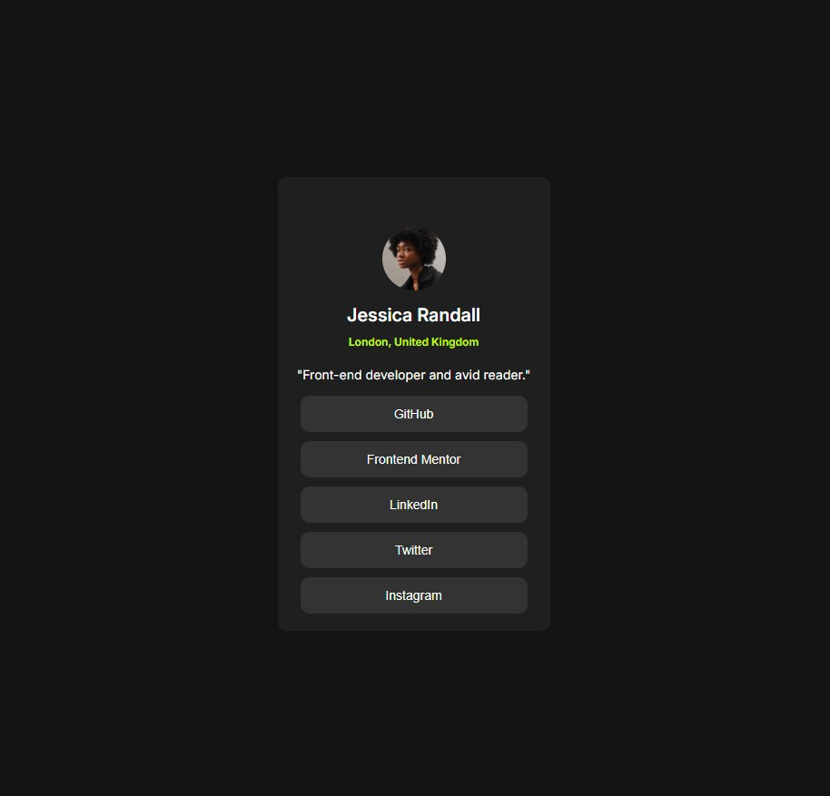

# Social Links Profile

This project is a solution to the **Social Links Profile** challenge from [Frontend Mentor](https://www.frontendmentor.io/). The goal was to build a responsive profile card that includes a profile picture, name, location, a short bio, and a list of social links — all styled to match the provided design as closely as possible.

## 📸 Preview

## 🚀 Features

- Fully responsive design
- Accessible and semantic HTML5 markup
- Styled using CSS Flexbox and custom properties
- Includes hover and focus states for all interactive elements

## 🛠️ Technologies Used

- HTML5 (semantic markup)
- CSS3
  - Flexbox layout
  - CSS custom properties (variables)

## 📚 What I Learned

This challenge helped reinforce the use of semantic HTML and CSS fundamentals like Flexbox. I also practiced paying close attention to visual details to match a design spec and ensuring accessibility through focus states.

## ✅ Status

✅ Completed — but I’m always open to improvements and feedback!

